# Slidev のテスト2
https://sli.dev/guide/
---

## 目次

<div class="grid grid-cols-2 gap-4">
<div>

<!-- TOC depthfrom:2 depthto:2 -->

- [https://sli.dev/guide/](#httpsslidevguide)
- [目次](#%E7%9B%AE%E6%AC%A1)
- [見出し](#%E8%A6%8B%E5%87%BA%E3%81%97)
- [箇条書き](#%E7%AE%87%E6%9D%A1%E6%9B%B8%E3%81%8D)
- [画像](#%E7%94%BB%E5%83%8F)
- [図形画像](#%E5%9B%B3%E5%BD%A2%E7%94%BB%E5%83%8F)
- [グラフ](#%E3%82%B0%E3%83%A9%E3%83%95)
- [配置](#%E9%85%8D%E7%BD%AE)
- [表](#%E8%A1%A8)
- [文字修飾](#%E6%96%87%E5%AD%97%E4%BF%AE%E9%A3%BE)
- [絵文字](#%E7%B5%B5%E6%96%87%E5%AD%97)
- [テーマ](#%E3%83%86%E3%83%BC%E3%83%9E)
- [テンプレート](#%E3%83%86%E3%83%B3%E3%83%97%E3%83%AC%E3%83%BC%E3%83%88)

<!-- /TOC -->

</div>
<div>

- [ ] item
- [x] checked item

- 絵文字
- チェックボックス
- 数式
- コードブロック
- リンク
- 注釈
- テーマ
- テーマのカスタマイズ
- ヘッダ、フッタ
- 背景画像
- 見出し幅の調整
- ページ番号非表示
- 段組み
- エクスポート
- 拡張機能
- SPA

</div>
</div>

---

## 見出し

<div class="grid grid-cols-2 gap-4">
<div>

```markdown
### 見出し 3

#### 見出し 4

##### 見出し 5

###### 見出し 6

####### 見出し 7 (見出しは 6 まで)
```

</div>
<div>

### 見出し 3

#### 見出し 4

##### 見出し 5

###### 見出し 6

####### 見出し 7 (見出しは 6 まで)

</div>
</div>

---

## 箇条書き

<div class="grid grid-cols-2 gap-4">
<div>

```markdown
### 番号なし

- あああ
- あああ
- あああ
* あああ
+ あああ

### 番号あり

1. あああ
1. あああ
1. あああ
    1. いいい
    1. いいい
```

</div>
<div>


### 番号なし

- あああ
- あああ
- あああ
* あああ
+ あああ

### 番号あり

1. あああ
1. あああ
1. あああ
    1. いいい
    1. いいい

</div>
</div>

---

## 画像

ローカル画像は`public`フォルダに格納し`/`を指定します。

<div class="grid grid-cols-2 gap-4">
<div>

```markdown
- リモート画像


- ローカル画像


- 影付き

```

</div>
<div>

- リモート画像


- ローカル画像


- 影付き


</div>
</div>

---

## 図形画像

Drawio で作成したSVG 画像を埋め込みます。

<div class="grid grid-cols-2 gap-4">
<div>

```markdown

```

</div>
<div>


</div>
</div>

---

## グラフ

Vega で作成したグラフを埋め込みます。

<div class="grid grid-cols-2 gap-4">
<div>

```markdown

```

</div>
<div>


</div>
</div>

---

## 配置


<div class="grid grid-cols-2 gap-4">
<div>

```markdown
<div class="absolute left-30px bottom-30px">
This is a left-bottom aligned footer
</div>
```

</div>
<div>

<div class="absolute left-30px bottom-30px">
This is a left-bottom aligned footer
</div>

</div>
</div>

---

## 表

<div class="grid grid-cols-2 gap-4">
<div>

```markdown
#|aaaa|bbbb
:-|:-|:-
1|aaaa|bbbb
2|aaaa|bbbb
3|aaaa|bbbb
4|aaaa|bbbb
5|aaaa|bbbb
```

</div>
<div>

#|aaaa|bbbb
:-|:-|:-
1|aaaa|bbbb
2|aaaa|bbbb
3|aaaa|bbbb
4|aaaa|bbbb
5|aaaa|bbbb

</div>
</div>

---

## 文字修飾

<div class="grid grid-cols-2 gap-4">
<div>

```markdown
標準

*強調*

_強調_

**強調**

__強調__

~~訂正~~

> 引用
```

</div>
<div>

標準

*強調*

_強調_

**強調**

__強調__

~~訂正~~

> 引用

</div>
</div>

---

## 絵文字

https://emojipedia.org/

コピーペーストする。

<div class="grid grid-cols-2 gap-4">
<div>

```markdown
😀💣🍦👍👎⭐
```

</div>
<div>

😀
💣
🍦
👍
👎
⭐

</div>
</div>

---

## テーマ

https://sli.dev/themes/gallery.html

テーマを指定するとslidev 起動時にテーマをインストールするか質問されます。

<div class="grid grid-cols-2 gap-4">
<div>

```markdown
---
theme: seriph
---
```

</div>
<div>

</div>
</div>

---

## テンプレート

<div class="grid grid-cols-2 gap-4">
<div>

```markdown

```

</div>
<div>

</div>
</div>
